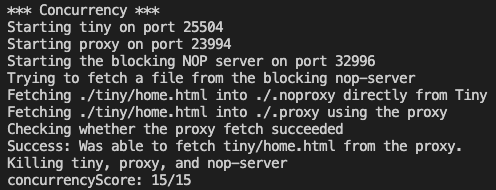
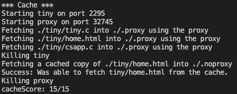
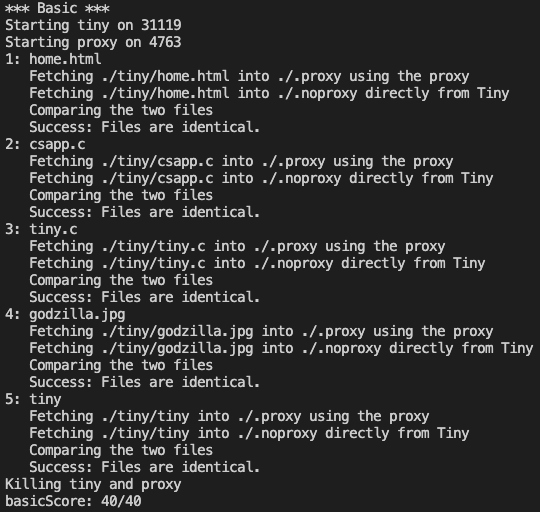
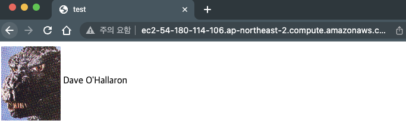
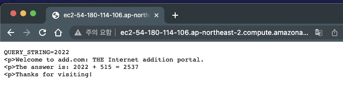
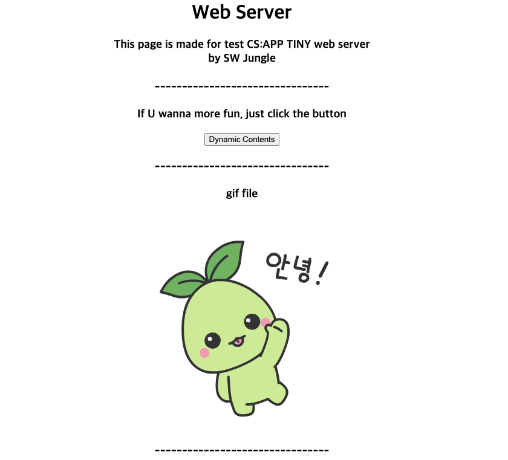
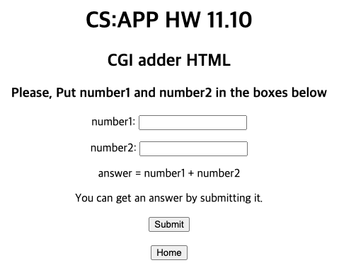

# _Make Web Server and Proxy_ (CS:APP)

> ### SW Jungle Week07 (12 ~ 19 May, 2022)

## TIL (Today I Learned)
### `Thu. 19` : End of the week

- Code Review (Jungle Reviewer)

### `Wed. 18`

- Concurrent Proxy




- Cache Server




- 우아한Tech Youtube [10분 테코톡]
    - 🌷 코다의 Process vs Thread
    - 🧲 코일의 Web Socket
    - 🎲  와일더의 Mutex vs Semaphore

### `Tue. 17`

- Make Sequential Proxy server



- 우아한Tech Youtube [10분 테코톡]
    - 🔮 히히의 OSI 7 Layer
    - 🔮 수리의 TCP/IP

### `Mon. 16`
- Study about Proxy
    - what is proxy?
    - how proxy work?
- why we use Proxy?
    - pros and cons
    - Application example
- 우아한Tech Youtube [10분 테코톡]
    - 🌟 조앤의 Forward Proxy vs Reverse Proxy vs Load Balancer

### `Sun. 15`

- make TINY web server
    - make main page and adder page





- `change main.html more fancy`
    - write some information about this page
    - make button which linked to CGI adder HTML
    - add gif file and MPG file



- `CS:APP HW11.7`
    - add MPG file type

- `CS:APP HW11.10`
    - make HTML for CGI adder function



### `Sat. 14`

- Study CS:APP Chapter 11. Network Programming
    - especially study about Socket (Ch 11.4)
        - socket function
        - echo routine
        - web - MIME, HTTP transaction, static and dynamic contents
    

### `Fri. 13`
- Study CS:APP Chapter 10. System-Level I/O
- Study CS:APP Chapter 11. Network Programming
    - especially study Ch 11.1 ~ 11.3


### `Thu. 12 May` - Week07 Start

- clone web-server to my [github repo.](https://github.com/latteishorse/webproxy-jungle)
- setting test env.
    - aws ec2 (ubuntu 20.04)
- Study about Network
    - Network Basics
        - throughput, latency, network topology
        - Network Command
        - Network Protocol
    - TCP/IP 4 Layer, OSI 7 Layer
    - IP Address
    - HTTP
    
---
<details>
<summary>Original webproxy README</summary>
<div markdown="1">

``` txt
####################################################################
# CS:APP Proxy Lab
#
# Student Source Files
####################################################################

This directory contains the files you will need for the CS:APP Proxy
Lab.

proxy.c
csapp.h
csapp.c
    These are starter files.  csapp.c and csapp.h are described in
    your textbook. 

    You may make any changes you like to these files.  And you may
    create and handin any additional files you like.

    Please use `port-for-user.pl' or 'free-port.sh' to generate
    unique ports for your proxy or tiny server. 

Makefile
    This is the makefile that builds the proxy program.  Type "make"
    to build your solution, or "make clean" followed by "make" for a
    fresh build. 

    Type "make handin" to create the tarfile that you will be handing
    in. You can modify it any way you like. Your instructor will use your
    Makefile to build your proxy from source.

port-for-user.pl
    Generates a random port for a particular user
    usage: ./port-for-user.pl <userID>

free-port.sh
    Handy script that identifies an unused TCP port that you can use
    for your proxy or tiny. 
    usage: ./free-port.sh

driver.sh
    The autograder for Basic, Concurrency, and Cache.        
    usage: ./driver.sh

nop-server.py
     helper for the autograder.         

tiny
    Tiny Web server from the CS:APP text
```
</div>
</details>

*This page was most recently updated on May 18th, 2022*